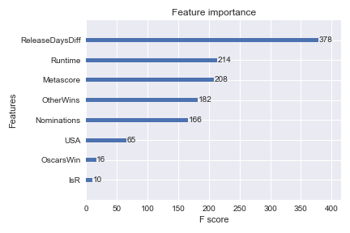

Project 6 - APIs + RandomForests Executive Summary
--

**Problem**: 
We are helping Netflix examine what factors lead to certain ratings for movies, particulary movies that are considered classics and are highly regarded throughout history. Netflix wants to offer these top movies to users as part of their recommendations regardless of the user's past viewing history. IMDB's top 250 movies of all time is a well-renowned list, and we will use these movies to offer to Netflix users. We can ignore the fact that the two websites' rating systems are fundamentally different and on different scales. 

Therefore, the problem I am trying to answer is how can we classify movies that made it into the top 250 IMDB list from movies that are not in that list. Feature importance and our predictions may lead to future predictions of movies that have the potential to make it to IMDB's top 250 movies list, and add to our recommendations. 

**Data**:
I scraped IMDB's top 250 movies using BeautifulSoup4 and OMDb API, and created a dataframe with 22 features. I added an extra column as a dummy variable to indicate that these were in the top 250 list. 

Now I needed to scrape more movies that are not in this list. Exploring IMDB's website for a random sample of movies is quite difficult, as they are all sorted by some sort of metric (e.g. popularity). I decided to download a IMDB dataset off Kaggle which has 5,043 movies, and combined it with my newly scraped data of this week's top box office movies, and IMDB's bottom 100 movies of all time. This ensured a large enough population to randomly select samples from, and I ended up with a dataset of 500 movies. I tried to keep the binary classification variable balanced at the expense of a smaller population. Otherwise if we included all 5,000+ movies, we would have to train our models on different clusters of the 5000+ movies. 

I performed some basic data cleaning techniques such as splitting strings, replacing values, converting data types, and creating dummy variables. In the end, I decided to use these features: **Metascore**, **Runtime**, **Oscar Wins**, **Award Nominations**, **Award Wins (not Oscars)**, **Produced in USA**, **Rated R**, and **Relative Release Date**. This last date-time feature I used was determined by the dataset's earliest released film, Feb. 6, 1921, and the latest released film, March 3, 2017 (please see Jupyter Notebook for more details). Generally, the median IMDB rating was quite high, at 8/10, and the median number of votes was 96,449. I decided not to include these two features, as they heavily influence the rating system of IMDB's top 250 list. Included below is a heatmap of the correlations of the features, which helped me with feature selection. 

**Modeling**:
I compared the performances between Decision Tree Classifier, Random Forest Classifier, Bagging Decision Tree Classifier, Extra Trees Classifier, Adaboosting Decision Tree Stumps, Gradient Boost, and Extreme Gradient Boost. 

All models were fed the same features and had their hyperparameters tuned and optimized by Grid Search. Typically, all of their training scores were extremely high, but their test scores were quite similar as well, ranging from 79.33% - 85.99% in terms of mean-accuracy. Surprisingly, Extreme Gradient Boost did not perform the best, achieving a mean-accuracy of 84%. This is probably due to the low population size of 500. The best model turned out to be Extra Trees Classifier with a mean accuracy score of 85.99%. There was a good balance in true positives/negatives in our confusion matrix, with 59 true negatives out of 69 and 70 true positives out of 81. The features that had the most impact whether positively or negatively were **Relative Release Date**, **Metascore**, **Runtime**, **Other Award Wins**, and **Award Nominations**. To show this visually, I included a graph made from the Extreme Gradient Boosting library as an example of feature importance.

**Conclusion**:
Extra Trees are trained using bagging and a random subspace method, but also includes another level of randomness by randomly selecting a value to be split at each node, instead of locally optimizing a feature/split combination. Using averaging improves the predictive accuracy and controls over-fitting. These reasons may indicate why Extra Trees performed better that the other tree-based models. Things to improve on would be generating more features, for example, finding key-words in titles and plots, and tuning different hyperparameters (especially for XGBoost). The next steps for this model are to regularly update it as the top 250 list changes day-to-day, to feed new movie data and see what movies also deserve to be in IMDB's top 250 list, and add or subtract which movies to recommend to our Netflix users. 